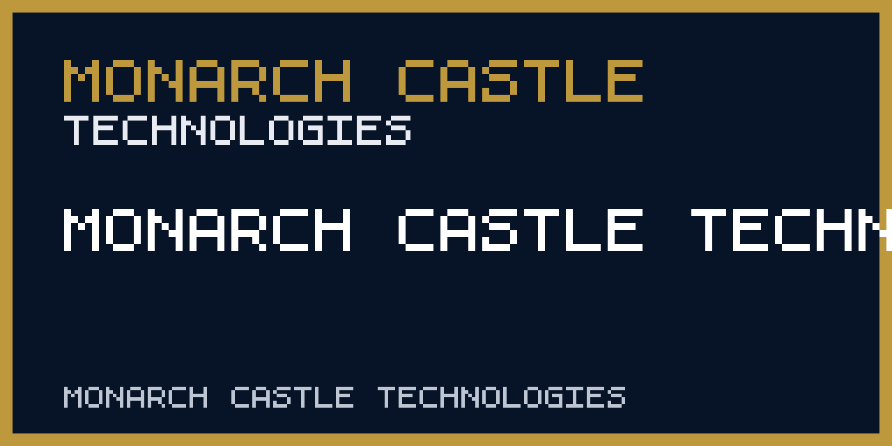

# Monarch Castle Technologies Website

---

<!-- repository-hygiene:start -->


Public website for Monarch Castle Technologies

The site presents **The Keep**, a unified private-sector early-warning platform. Existing public products remain free; commercial access applies only to the unified workspace, private integrations, team workflows, delivery guarantees, and support.


## Repository status

Lifecycle: **Active**. The badge and this statement describe maintenance status, not service availability.

## Public access

The canonical production route is [monarchcastle.com](https://monarchcastle.com/). The site origin remains the GitHub Pages host; the public custom domain is terminated at the Cloudflare edge, so no Pages CNAME is published.

The public portfolio includes the
[Süper Lig Forecast](https://monarchcastle.com/superlig-forecast/),
a daily five-million-path title, table, and match-outcome forecast with a
published 20-season expanding-window backtest.

## Screenshots



The preview is maintained as a repository asset; the live interface or generated output remains authoritative.

## Data and methodology

- [site.routes.json](site.routes.json)

These repository-specific sources define the methodology or provenance boundary. Source dates, transformation steps, and known gaps must travel with analytical outputs.

## Update frequency

Release-driven; rebuilt when approved company or portfolio content changes.

## Quick start

```shell
npm ci
npm run sync
npm run build
```

Run only in a trusted development environment and review repository-specific prerequisites before using networked or hardware features.

Regenerate and verify the local public registry projection with:

```shell
npm run sync:content
npm run check:content
```

## Architecture

- `site.routes.json` — the single route manifest for the homepage, twelve narrative routes, supporting pages, and mounted dashboards.
- `src/content/site.json` — deterministic generated projection of the approved portfolio and brand registries.
- `src/content/editorial.json` — non-inventory narrative, contact, trust, and capability copy.
- `scripts/sync-content.mjs` — fail-closed governance projection and approved-mark synchronizer.
- `scripts/build-site.mjs` — self-contained narrative renderer plus dashboard mount pipeline.
- `src/styles/identity.css` — company-wide visual system layered over the base site styles.
- `src/scripts/hero-loader.js` and `src/scripts/hero-scene.js` — desktop Three.js scene, loaded on demand with an SVG fallback for small screens, reduced motion, and unavailable WebGL.
- `scripts/verify-dist.mjs` — route, metadata, local-reference, claims, and dashboard boundary verifier.
- `src/scripts/platform.js` — deterministic, no-storage public The Keep preview over mounted BNTI, WTI, and MENA outputs.
- `docs/business/` — market-entry, pricing, pilot, target-account, and incorporation preparation records.
- `docs/architecture/the-keep.md` and `docs/runbooks/platform-operations.md` — Codex-independent operating architecture and incident runbook.

## Tests

```shell
npm test
npm run build
npm run test:dist
npm run browser:test
```

## Provenance

Original software history is maintained in Git. External datasets, reports, trademarks, screenshots, and assets are not relicensed by this repository; see [THIRD_PARTY_NOTICES.md](THIRD_PARTY_NOTICES.md) before reuse.

## Forecast limitations

This repository does not publish a guaranteed forecast. Any scenarios, scores, or forward-looking language are analytical aids, not facts or advice; review source dates and methodology before use.

## Security

Do not publish vulnerabilities in an issue. Use GitHub's private vulnerability-reporting flow when available, or follow the [organization security policy](https://github.com/MonarchCastleTech/.github/security/policy).

## License

Original repository code and documentation are available under **MIT**; see [LICENSE](LICENSE). That license does not override third-party terms documented in [THIRD_PARTY_NOTICES.md](THIRD_PARTY_NOTICES.md).

## Citation

Use the machine-readable [CITATION.cff](CITATION.cff). Cite the specific commit and, for analytical use, record the data or model snapshot date.

## Masterbrand endorsement

Monarch Castle Technologies Website is a Monarch Castle Technologies project. **Part of Monarch Castle Technologies.**

<!-- repository-hygiene:end -->
